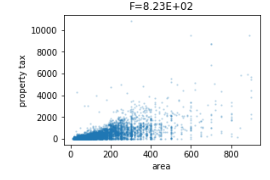
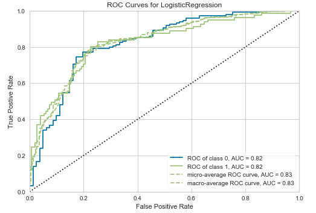

# DS projects

## WebScapping

•	[Tweet Search](https://nbviewer.jupyter.org/github/BrunoPTeruya/Projetos-Data-Science/blob/master/Pesquisando%20Tweets.ipynb). Podemos pesquisar tweets com o API tweepy.

•	[Scrapping tweets](https://nbviewer.jupyter.org/github/BrunoPTeruya/Projetos-Data-Science/blob/master/Tweets%20em%20streaming.ipynb) com API Streaming. Com essa funcionalidade podemos obter tweets em tempo real buscando por determinado assunto. Pode ser utilizado para análise de sentimento.

## Regressão Linear

•	[Aluguel em SP](https://nbviewer.jupyter.org/github/BrunoPTeruya/Portfolio/blob/master/Aluguel%20em%20SP.ipynb). Nessa base temos características de imóveis e o valor total a ser gasto mensalmente

•	[Fármaco](https://nbviewer.jupyter.org/github/BrunoPTeruya/Projetos-Data-Science/blob/master/Pharma.ipynb). Essa base apresenta vendas de remédios no ano de 2015. A regressão é para prever valores de Revenue.

## Seleção de Variáveis

•	[Otto](https://nbviewer.jupyter.org/github/BrunoPTeruya/Projetos-Data-Science/blob/master/Otto.ipynb). A base possui 93 parâmetros e o target. O objetivo foi selecionar e reduzir a quantidade desses parâmetros usando Boruta, Chi2, RFE, Random Forest e Variance Threshold.

## EDA

•	[Combustíveis](https://nbviewer.jupyter.org/github/BrunoPTeruya/Projetos-Data-Science/blob/master/Pre%C3%A7os%20de%20combust%C3%ADveis.ipynb). Conjunto de dados oriundo da ANP. Trás os valores de venda nos postos, a cidade, região e a bandeira.

## Tratamento de dados

•	[85_cars](https://nbviewer.jupyter.org/github/BrunoPTeruya/Projetos-Data-Science/blob/master/Cars.ipynb). 

## Classificação

•	[Diabetes](https://nbviewer.jupyter.org/github/BrunoPTeruya/Portfolio/blob/master/Diabetes%20Pima.ipynb). Nessa base tentamos prever casos de diabetes de acordo com as características dos pacientes. São selecionadas as principais colunas e aplicados modelos de machine learning

•	[Cancelamento de Cartão de Crédito](https://nbviewer.jupyter.org/github/BrunoPTeruya/Portfolio/blob/master/Cancelamento%20de%20Cart%C3%A3o%20de%20Cr%C3%A9dito.ipynb). Queremos saber quais clientes irão cancelar o cartão de crédito

• [Atraso de voos](https://nbviewer.jupyter.org/github/BrunoPTeruya/Portfolio/blob/master/Voos_Bruno_Teruya.ipynb). As bases são de janeiro de 2019 e 2020 com voos do EUA. A análise foi feita buscando as principais causas para os atrasos
